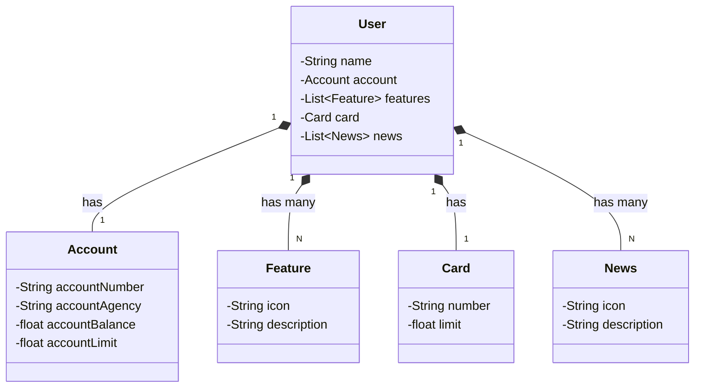

# Santander Dev Week
Java RESTful API criada para a Santander dev weeek

## Diagrama de Classes

```mermaid
classDiagram
    class User {
        -String name
        -Account account
        -List~Feature~ features
        -Card card
        -List~News~ news
    }

    class Account {
        -String accountNumber
        -String accountAgency
        -float accountBalance
        -float accountLimit
    }

    class Feature {
        -String icon
        -String description
    }

    class Card {
        -String number
        -float limit
    }

    class News {
        -String icon
        -String description
    }

    User "1" *-- "1" Account : has
    User "1" *-- "N" Feature : has many
    User "1" *-- "1" Card : has
    User "1" *-- "N" News : has many

```
